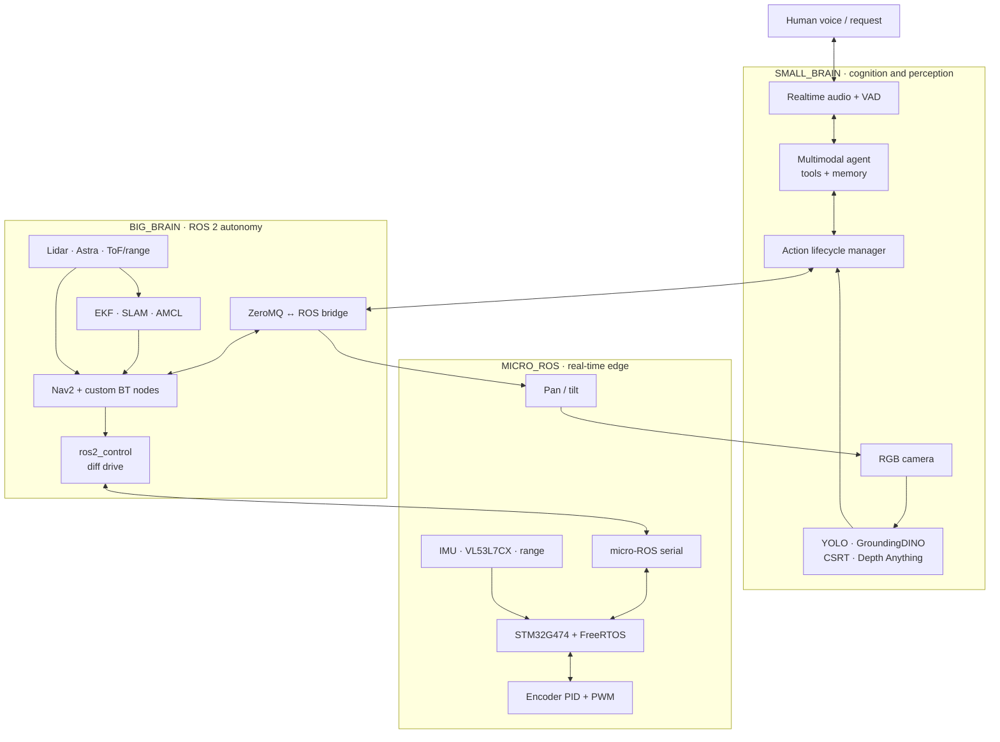

# DJ — A Full-Stack Mobile Robot with Acceptable Intelligence

<p align="center">
  <strong>A physical 2WD robot that can listen, speak, see, search, track, approach, map, navigate, and remember.</strong>
</p>

<p align="center">
  <a href="https://docs.ros.org/en/jazzy/"></a>
  <a href="https://ubuntu.com/"></a>
  <a href="https://www.st.com/en/microcontrollers-microprocessors/stm32g474re.html"></a>
  <a href="https://docs.openvino.ai/"></a>
  <a href="https://developers.openai.com/api/docs/models/gpt-realtime-2.1-mini"></a>
</p>

DJ (Dang Junior) is an end-to-end mechatronics and embodied-AI project. It spans real-time STM32 firmware, micro-ROS transport, ROS 2 control and navigation, GPU-accelerated perception, and a realtime multimodal agent that turns natural speech into physical behavior.

This is not a chatbot attached to a motor driver. DJ maintains a structured action lifecycle, moves a pan/tilt camera to search its environment, selects a detector based on the target, visually closes the tracking loop, estimates target pose with range sensing, and hands motion to Nav2 when an approach requires safe navigation.

> [!IMPORTANT]
> This repository targets a real robot and is under active development. Read the [safety notes](#safety) and complete the [from-scratch setup guide](SETUP_FROM_SCRATCH.md) before powering the drive motors.

## Why “acceptable intelligence”?

The project explores a practical definition of robot intelligence: not artificial general intelligence, but enough situated intelligence to perceive, decide, act, observe the result, and recover in the physical world.

- Deterministic systems handle motor control, transforms, state estimation, collision data, and navigation.
- Probabilistic systems handle language, visual understanding, open-vocabulary targets, and high-level action selection.

The AI is grounded in explicit tools, sensor feedback, action preconditions, and completion events rather than unrestricted velocity generation.

## System at a glance

| Capability | Implementation |
|---|---|
| Platform | Physical differential-drive robot with a 240 × 240 mm modeled base |
| Embedded control | STM32G474, FreeRTOS, micro-ROS, encoder feedback, 100 Hz wheel PID |
| Robot runtime | Ubuntu 24.04, ROS 2 Jazzy, Cyclone DDS, `ros2_control` |
| Localization | Wheel odometry + MPU6050 yaw-rate fusion through `robot_localization` EKF |
| Mapping | SLAM Toolbox with an included saved occupancy map |
| Navigation | Nav2, MPPI controller, NavFn planner, custom behavior-tree plugins |
| Obstacle perception | RPLIDAR C1, Orbbec Astra point cloud, 8×8 VL53L7CX ToF, side range sensors |
| AI perception | YOLO detection/pose, GroundingDINO, CSRT, Depth Anything V2; experimental SAM2 service |
| Interaction | Full-duplex microphone/speaker pipeline with server-side voice activity detection |
| Agent | OpenAI Realtime over WebSocket with typed function tools and action results |
| Local IPC | ZeroMQ request/reply and publish/subscribe bridge between AI and ROS 2 |
| Memory | Persistent facts and identity updates separated from the committed robot identity |

## Architecture

The codebase is intentionally split into three “brains,” each responsible for the work it is best suited to do.



### `SMALL_BRAIN` — embodied cognition

`SMALL_BRAIN` is an asynchronous Python runtime built around a live camera, live audio, local vision workers, and the OpenAI Realtime API.

| Action | What the robot does |
|---|---|
| `see_action` | Captures the current view and answers a focused visual question |
| `search_action` | Checks the current frame, sweeps the pan/tilt camera, evaluates image batches, and centers the best candidate |
| `track_action` | Tracks known objects, arbitrary text-described objects, people, or selected body parts |
| `approach_action` | Waits for stable tracking, computes a local pose from servo angles and ToF range, then dispatches a Nav2 goal |
| `move_action` | Executes a bounded timed translation/rotation for short blind or expressive movement |

Long-running actions return an immediate structured result and later publish a separate completion event. The cognition manager attaches unique action IDs, rejects conflicting starts, exposes matching stop tools, and feeds outcomes back to the agent before another decision is made.

The perception pipeline is adaptive:

- A custom YOLO detector handles the robot's known object vocabulary.
- YOLO pose tracks people and can retarget through the human skeleton to a requested body part.
- GroundingDINO provides open-vocabulary detection outside the fixed detector classes.
- OpenCV CSRT provides lightweight frame-to-frame object tracking after acquisition.
- A narrow-beam range sensor supplies metric distance for target-relative approach goals.
- Depth Anything V2 runs as an OpenVINO service; the SAM2 OpenVINO service is present but not wired into the default runtime.

### `BIG_BRAIN` — ROS 2 autonomy

`BIG_BRAIN` turns embedded telemetry into standard ROS messages and coordinates:

- Xacro/URDF robot model and TF tree
- Topic-based `ros2_control` hardware interface and 50 Hz control manager
- Fused wheel odometry and IMU yaw rate via a 25 Hz EKF
- SLAM Toolbox mapping and AMCL saved-map localization
- Nav2 with MPPI local control and NavFn global planning
- Lidar, depth-camera, ToF point-cloud, and range-sensor obstacle layers
- ZeroMQ AI commands, state, tracking corrections, and completion events
- Utility nodes for trajectories, servo teleoperation, and BLE ring control

#### Custom Nav2 behavior

Approaching a person or object creates edge cases a generic “navigate to this exact point” pipeline does not handle well. This project adds three C++ BehaviorTree.CPP plugins:

- `DJGoalValidator` samples footprint-valid replacement poses when a requested goal is occupied, preferring the nearest viable pose facing the target.
- `DJPathValidator` observes replans, groups similar paths into corridors, selects a representative corridor, and can truncate a path before its first collision.
- `BlindBackUp` provides a timed recovery maneuver and always stops when it completes or is halted.

The custom approach tree combines these with planner/controller recovery and local/global costmap clearing.

### `MICRO_ROS` — firmware and hardware control

`MICRO_ROS` contains the STM32CubeMX project, first-party application code, and build integration needed to regenerate and flash the controller.

- Closed-loop encoder velocity control with feed-forward + PID at 100 Hz
- Wheel position and velocity telemetry at 50 Hz
- MPU6050 acquisition, calibration, complementary filtering, and bus recovery
- Dual side range sensors and a forward TFmini-S rangefinder
- VL53L7CX 8×8 ranging data at 10 Hz
- Pan/tilt servo control with step and range limits
- micro-ROS serial transport at 921600 baud
- Statically allocated ROS message buffers for the embedded target

## End-to-end behavior

A request such as **“find the bottle and go near it”** crosses the whole stack:

1. The realtime agent interprets speech and calls `search_action`.
2. The RGB camera checks its current view, then sweeps configured pan/tilt rows if needed.
3. The best candidate is centered and returned as a structured result.
4. `track_action` selects YOLO or GroundingDINO for acquisition, then closes the visual loop with pose tracking or CSRT.
5. Pan/tilt error streams to ROS; the camera servos move first, and the base rotates when pan travel is exhausted.
6. `approach_action` combines stable tracking, range, and camera azimuth into a local goal.
7. The bridge transforms that goal into `map`; Nav2 plans and executes a collision-aware path.
8. Success, rejection, cancellation, or failure returns to cognition so the agent reassesses instead of assuming success.

## Hardware represented in the project

| Subsystem | Device / role |
|---|---|
| Compute | ASUS NUC 14 running Ubuntu and ROS/AI workloads |
| Controller | STM32G474 with FreeRTOS |
| Drive | Two encoded DC motors in differential drive |
| 2D ranging | Slamtec RPLIDAR C1 |
| RGB-D sensing | Orbbec Astra plus a separate RGB camera stream |
| Short-range 3D | ST VL53L7CX 8×8 ToF array |
| Target distance | Benewake TFmini-S aligned with the movable camera |
| Proximity | Left and right serial range sensors |
| Inertial sensing | MPU6050 accelerometer/gyroscope |
| Active vision | Two-axis pan/tilt servo mount |
| Voice I/O | Microphone and speaker through PyAudio |

Exact device paths, dimensions, transforms, calibration multipliers, and sensor placements are captured in launch, controller, and Xacro files rather than left as undocumented machine state.

## Software stack

| Area | Main technologies |
|---|---|
| Embedded | C, STM32 HAL, FreeRTOS/CMSIS-RTOS, micro-ROS/rclc |
| Robotics | ROS 2 Jazzy, Nav2, SLAM Toolbox, AMCL, `robot_localization`, `ros2_control` |
| Navigation extensions | C++, BehaviorTree.CPP, custom Nav2 cost/validity logic |
| AI runtime | Python, `asyncio`, WebSockets, ZeroMQ |
| Vision | OpenCV, OpenVINO, YOLO, GroundingDINO, Depth Anything V2, SAM2 |
| Audio/language | PyAudio, OpenAI Realtime, realtime transcription and function calling |
| Reproducibility | vcstool, sparse Nav2 checkout, upstream patches, pinned Python requirements |

## Repository layout

```text
.
├── BIG_BRAIN/                   # ROS 2 Jazzy workspace
│   └── src/
│       ├── robot/               # Launch, URDF, maps, config, Python bridges
│       └── custom_nav2_plugins/ # Three C++ behavior-tree plugins
├── SMALL_BRAIN/                 # Voice agent, cognition, behavior, local vision
│   ├── actions/                 # See, search, track, approach, move
│   ├── cognition/               # Event-driven action coordinator
│   ├── database/                # Identity, state, memory schema
│   ├── services/                # Camera, audio, models, tracker, responses
│   ├── tools/                   # Function-tool JSON schemas
│   └── vision_models/           # Model export/integration tooling
├── MICRO_ROS/                   # STM32G474 CubeMX project and firmware
├── patches/                     # Reviewable changes to upstream projects
├── third_party.repos            # External-source vcstool manifest
└── SETUP_FROM_SCRATCH.md        # Complete clean-machine setup
```

## Getting started

### Prerequisites

- Ubuntu 24.04 and ROS 2 Jazzy
- Intel GPU visible to OpenVINO for the default AI configuration
- STM32CubeMX, ARM GCC, Docker, and ST-Link tools for firmware regeneration
- The physical sensors and serial mappings expected by the launch files
- An `OPENAI_API_KEY` with access to the configured realtime model

ROS and STM32 can be tested without an Intel GPU. The default AI services explicitly request `GPU` / `intel:gpu`, so CPU-only systems require a code-level device fallback.

### Install from a clean machine

```bash
git clone https://github.com/Dddjdbcdn/mobile-robot-with-acceptable-intelligence.git
cd mobile-robot-with-acceptable-intelligence
export ROBOT_ROOT="$PWD"
```

Then follow **[SETUP_FROM_SCRATCH.md](SETUP_FROM_SCRATCH.md)** from beginning to end. It covers third-party import, sparse Nav2 checkout, four upstream patches, OS and GPU setup, ROS and Python builds, model restoration, STM32 regeneration/flashing, subsystem tests, and a final acceptance checklist.

Model weights, OpenVINO binaries, builds, secrets, mutable robot memory, and generated STM32 vendor trees are intentionally not stored in normal Git history.

## Build and run

These commands assume the complete setup guide has succeeded.

### Build ROS 2

```bash
cd "$ROBOT_ROOT/BIG_BRAIN"
source /opt/ros/jazzy/setup.bash
rosdep install --from-paths src --ignore-src -r -y
colcon build --symlink-install --cmake-args -DCMAKE_BUILD_TYPE=Release
source install/setup.bash
```

### Run the robot layer

```bash
cd "$ROBOT_ROOT/BIG_BRAIN"
source /opt/ros/jazzy/setup.bash
source install/setup.bash
ros2 launch robot bringup.launch.py
```

| Mode | Command |
|---|---|
| Hardware + control + EKF | `ros2 launch robot bringup.launch.py` |
| Live SLAM + navigation | `ros2 launch robot bringup.launch.py slam:=true nav2:=true` |
| Saved-map localization + navigation | `ros2 launch robot bringup.launch.py amcl:=true nav2:=true` |

### Run cognition and perception

In a second, graphical terminal:

```bash
cd "$ROBOT_ROOT/SMALL_BRAIN"
source venv/bin/activate
export OPENAI_API_KEY="your-key-here"
python main.py
```

The ROS layer must run first because it owns the ZeroMQ endpoints used by `SMALL_BRAIN`.

### Build and flash firmware

After regenerating the ignored STM32 vendor code and micro-ROS library per the setup guide:

```bash
cd "$ROBOT_ROOT/MICRO_ROS"
make clean
make -j"$(nproc)"
arm-none-eabi-size build/DJ_AMR_CUBEMX.elf
st-flash --reset write build/DJ_AMR_CUBEMX.bin 0x08000000
```

## Important ROS interfaces

| Topic / interface | Direction | Purpose |
|---|---|---|
| `/stm32/wheel_commands` | ROS → MCU | Wheel velocity commands through topic-based `ros2_control` |
| `/stm32/wheel_states` | MCU → ROS | Encoder position and velocity feedback |
| `/stm32/imu_msg` → `/imu` | MCU → bridge → ROS | Embedded data converted to standard IMU messages |
| `/stm32/tof_raw_data` → `/tof_pointcloud` | MCU → bridge → Nav2 | 64-cell ToF frame projected into 3D obstacle points |
| `/camera_tof` | Bridge → AI/Nav | Target-aligned metric range |
| `/scan` | RPLIDAR → ROS | Laser scan for SLAM, localization, and costmaps |
| `/camera/depth/points` | Astra → Nav2 | Depth points for the spatio-temporal voxel layer |
| `/diff_drive_controller/cmd_vel` | Nav/AI → control | Stamped base velocity command |
| `/stm32/servo_pan`, `/stm32/servo_tilt` | ROS → MCU | Active-camera commands |
| `navigate_to_pose` | AI bridge → Nav2 | Collision-aware approach action |
| ZeroMQ `5555/5556/5557` | AI ↔ ROS bridge | Commands, state/events, tracking corrections |

## Reproducibility

- `third_party.repos` records external repositories and compatibility branches.
- Only required Nav2 packages are populated through sparse checkout.
- Nav2, Astra, topic-based `ros2_control`, and micro-ROS changes are committed as patches.
- Python runtime dependencies are pinned.
- Runtime memory starts from `memory.example.json`; real `memory.json` stays local.
- Maps should be committed only when they reveal no private space.

See [patches/README.md](patches/README.md) for the patch inventory and [SETUP_FROM_SCRATCH.md](SETUP_FROM_SCRATCH.md) for validation commands.

## Safety

This software commands physical motors. Treat the robot as machinery.

- Lift the wheels before first flash, controller tuning, or direct motor tests.
- Keep an accessible physical emergency stop and a clear operating area.
- Test MCU, sensors, transforms, control, and Nav2 before enabling AI actions.
- Verify wheel direction, encoder polarity, range units, transforms, and footprint.
- Do not expose ZeroMQ command ports to an untrusted network.
- Never commit API keys, private maps, personal audio/video, or mutable memory.
- Supervise autonomous and LLM-selected motion; model output and detections can be wrong.

Software safeguards include a drive-command timeout, velocity/acceleration limits, explicit stop tools, action-busy rejection, search/tracking preconditions, costmap goal validation, and stop-on-halt backup behavior. They complement—rather than replace—physical safety.

## Current status and potential

DJ is a working research platform with the core vertical slice represented here: embedded I/O, closed-loop control, ROS integration, mapping/localization, custom navigation, realtime voice, local perception, active vision, action orchestration, and persistent memory.

The architecture can grow toward richer semantic world models, tighter sensor fusion, automatic docking, simulation and hardware-in-the-loop tests, adaptive search, semantic object memory, and stronger local safety supervision independent of the language model.

Some integration work remains intentionally visible: model export is evolving, SAM2 is not enabled by default, AI inference assumes Intel GPU acceleration, and there is not yet a simulation launch path. These are development frontiers, not hidden prerequisites.

## Author

Built by **Dang Nguyen**, a Mechatronics student at Ho Chi Minh City University of Technology (HCMUT), as an exploration of robots with both capability and character.

Repository: [Dddjdbcdn/mobile-robot-with-acceptable-intelligence](https://github.com/Dddjdbcdn/mobile-robot-with-acceptable-intelligence)

## License

No repository-wide license file is currently included. Until one is added, the source is available for viewing but no reuse rights are granted by default. Third-party components retain their own licenses.
